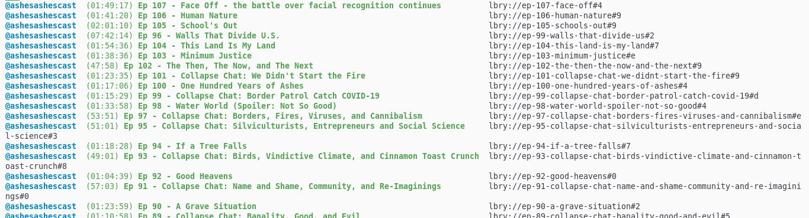
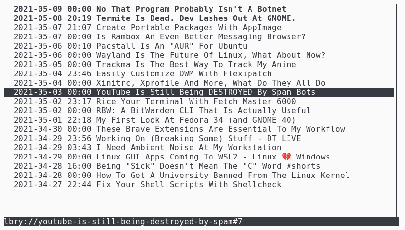

# lbt

**lbt** is a collection of command-line tools for interacting with the LBRY network, written in POSIX shell.

Currently, these tools are available:

* **lbt open** will open LBRY content in the user's preferred application. (think *xdg-open but for LBRY*)
* **lbt feed** is a very basic way to see the latest content from LBRY channels. (think [sfeed](https://codemadness.org/sfeed-simple-feed-parser.html) *but for LBRY*)
* **lbt ls** will list all LBRY content that's saved on this system.
* **lbt get** will simply fetch LBRY content and output it, either into a file or into standard output. (think *wget but for LBRY*)
* **lbt rm** will delete saved LBRY content.

All these tools support lbry:// protocol URLs, as well as [Odysee](https://odysee.com) and [open.lbry.com](https://open.lbry.com) links.

lbt can also convert **some YouTube video links** to LBRY videos automatically, if the creator uses the official [LBRY x YouTube Sync service](https://lbry.com/youtube).

## Why?

**lbt** might be useful if:

* You don't want to use the official Electron app or the lbry.tv web interface (which some might call "bloated").
* You want to work with LBRY content in your own shell scripts but don't want to mess with JSON output.

## Commands

### lbt open

**lbt open** will let you view LBRY content in your preferred application. It uses its own configuration file to determine how to open files: either fully download the file before opening it, or, if the application supports it, open a HTTP stream (useful for watching videos).

#### Example of usage

`lbt open "lbry://@BrodieRobertson#5/easy-motion-how-did-i-use-vim-until-now#9"`

opens [this video](https://open.lbry.com/@BrodieRobertson:5/easy-motion-how-did-i-use-vim-until-now:9), as a stream.

`lbt open "https://open.lbry.com/@AlexandreMarcotte777:0/brodie-robertson:1"`

downloads [this GIF](https://open.lbry.com/@AlexandreMarcotte777:0/brodie-robertson:1) and opens it in your preferred image viewer.

This behaviour can be changed using simple config files, namely `~/.config/lbt/config.json` and `~/.config/lbt/mimetypes`. The latter is based on the file's [MIME type](https://developer.mozilla.org/en-US/docs/Web/HTTP/Basics_of_HTTP/MIME_types):

```
video/*		stream
audio/*		stream
image/*		save 
text/html	stream
application/pdf	save 
*		save 
```

`config.json` can be used to change the run command, such as:
```json
{
	"use_xdg_open": false,
	"custom_open_command": "run-mailcap --action=view \"$mimetype:$1\""
}
```

(I recommend [https://github.com/cglindkamp/run-mailcap-rs](run-mailcap-rs), as the original Ubuntu version of `run-mailcap` doesn't work right with http:// links)

The config files are automatically generated on the first run. The simplest way to find out the MIME type is with the program's `--get-mime` parameter, for example:

```
> lbt open -m "https://lbry.tv/@grin:4/keep-it-simple:4"
Resolving lbry://@grin#4/keep-it-simple#4...
MIME type is text/markdown
```

### lbt get

**lbt get** is a lower-level utility: instead of opening content with an appropriate program, it simply grabs the needed file from the network and pipes it out. It can also just print out a URL that other programs can use.

#### Examples:

`lbt get "https://lbry.tv/@lbry:3f/julian-chandra-joins-lbry:8" | less`

downloads [this](https://lbry.tv/@lbry:3f/julian-chandra-joins-lbry:8) document and pipes it into `less`.

`lbt get --resolve --stream "https://open.lbry.com/@Jreg:2/chonky-cat:1"`

opens an HTTP stream and prints out the URL. This URL can be opened with a browser, a video player, etc.

`lbt get -rf "lbry://@TheLinuxGamer#f/Will-we-SURVIVE-the-Oregon-Trail#d"`

downloads the video into your local download directory, and prints out the file name.

### lbt feed

Output the latest content from LBRY channels.

#### Examples:

`lbt feed 'https://odysee.com/@ashesashescast:f'`

prints this:



It can also read channel names or URLs from a configuration file (`~/.config/lbt/feeds`).

Just for fun, you can also output data in a format compatible with [sfeed](https://codemadness.org/sfeed-simple-feed-parser.html) or `sfeed_plain`. This allows you to do cool things, like:

`lbt feed @BrodieRobertson @DistroTube --sfeed | sfeed_curses`



Alternatively, a simple dmenu/[bemenu](https://github.com/Cloudef/bemenu) script:

`lbt open "$(lbt feed | bemenu --list=10 | sed 's|^.*lbry://||')"`

### lbt ls

Lists all LBRY content which is saved on your system. Accepts lots of options for showing/hiding columns of information, sorting, filtering, etc.

#### Examples:

`lbt ls --files`

prints out all LBRY content which is saved in your downloads directory, as opposed to only being stored in blob format.

`lbt ls --channel --mime --sort=size --reverse`

prints out additional columns for the channel name and MIME type, and sorts files from largest to smallest.

### lbt rm

#### Examples:

`lbt rm "#aec4347ca0eaefea5eb92d4a51b25451d0581996" --file`

will delete [this](https://open.lbry.com/@davidpakman:7/how-the-internet-destroyed-your-brain:a) video from your LBRY library, as well as from your downloads folder.

`lbt rm "https://lbry.tv/@lbry:3f/fullscreenrelease:7" --no-blobs -f`

will delete the video from your downloads folder, but not from your LBRY library.

### contrib/

The `contrib/` folder includes some nice things, like an [fzf](https://github.com/junegunn/fzf) script for looking at subscribed channels. That code is provided by the community and is not ""officially"" a part of `lbt`, but could still be very useful to some people.

## Installation

### Arch Linux

Users of Arch and its derivatives can use the [AUR package](https://aur.archlinux.org/packages/lbt/), maintained by me.

### Other systems

Grab the latest version of `lbt` on the [Releases page](https://gitlab.com/gardenappl/lbt/-/releases). Extract the `lbt` file and put it into your PATH.

**Dependencies:**

* LBRY (**you must make sure that `lbrynet` [is in your PATH](https://lbry.com/faq/how-to-cli)**)
* curl
* [jq](https://stedolan.github.io/jq/)
* GNU gettext (for localizations, support is incomplete)
* sed, awk
* GNU coreutils (cut, ...), util-linux (column, getopt, ...)


If you want to use `lbt open` as the default handler for lbry:// links:

1. Get the `lbt-open.desktop` file.
2. Put it into `~/.local/share/applications`
3. Run `xdg-mime default lbt-open.desktop x-scheme-handler/lbry`

## What's next?

Unimplemented features:

1. Interacting with paid content (I'm too scared to touch the crypto wallet stuff)
2. Localization
3. `man` page
4. Shell completion
